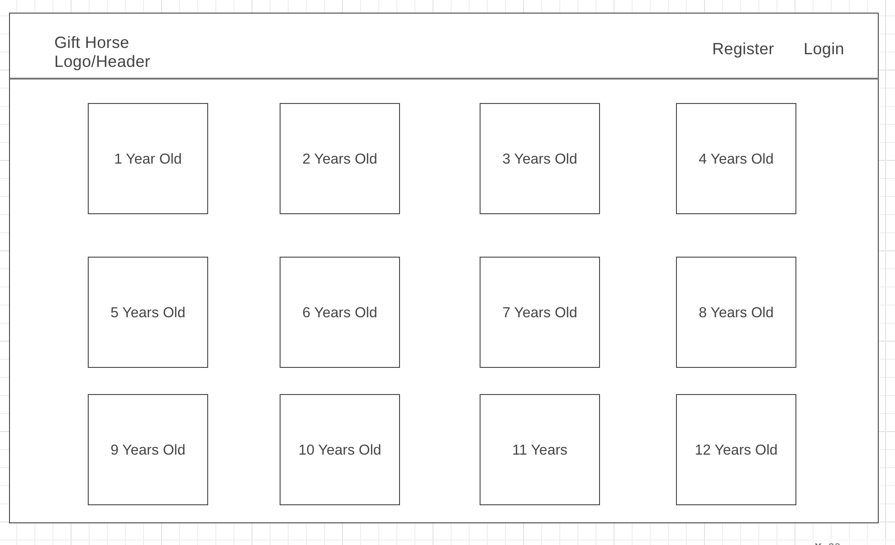
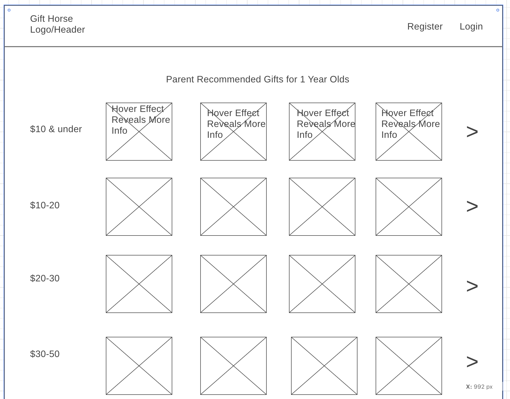
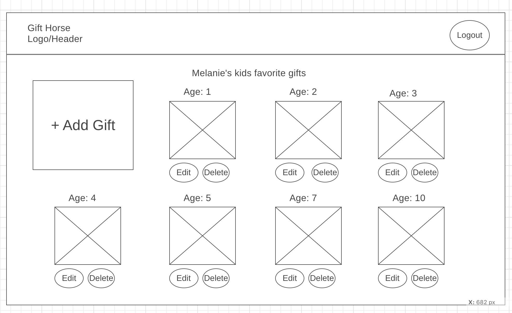
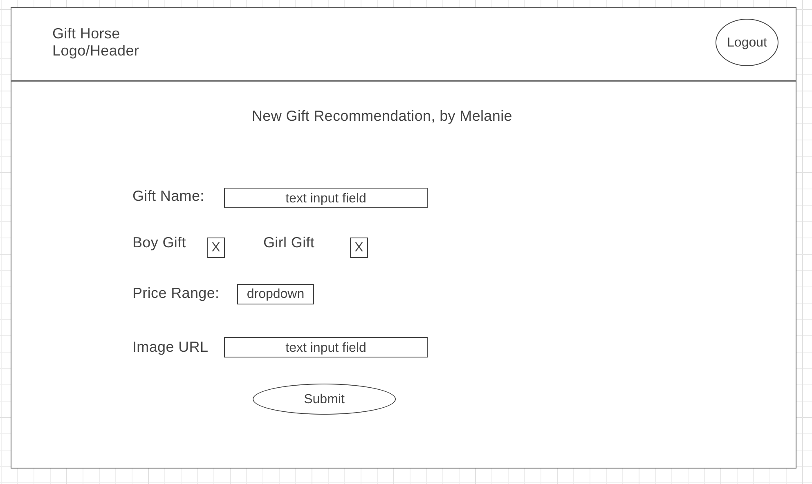
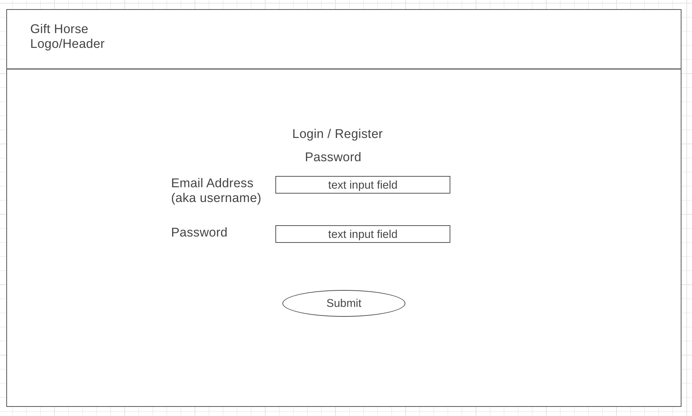
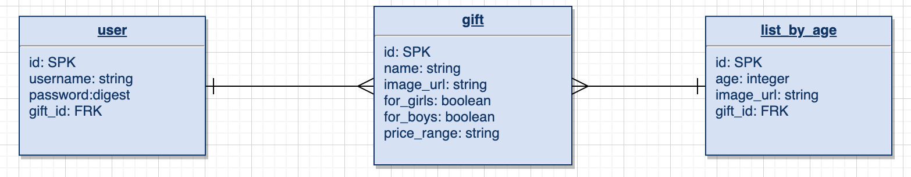

## Project 4 - Gift Horse

This is children's gift recommendation website which recommends gifts by age from years 1 to 12.  The target audience is people who don't have kids that age (or at all).  This site will provide them with parent recommended/kid approved present ideas.
Parents should register/login to input their kids favorite gifts

## Features

**MVP:**

1. The Homepage shows a list of 12 ages
2. Clicking on any of those ages will bring you to a screen with all the parent recommended gifts sorted by price rage
2. Clicking on the image of a gift will bring the user to Amazon.com where they can read reviews and purchase the item
2. User can register and log in; once logged in the user has the ability to add/edit/delete their gift ideas

**Post-MVP:**

1. Hover effects on gift images to display name of gift
2. Provide the ability to filter by age
3. Admin account to provide front end to delete photos or gifts w/improper details
4. Like/Recommended button on each gift so that the most popular gifts are showed first

## Technologies: REACT, HTML, CSS, AJAX, RUBY ON RAILS

## Wireframe
### Index Page

### Show Page

### User Page

### New Gift Form

### Login/Registration Page

### Entity Relationship Diagram (ERD) 

## My Journey
1. The scrolling gallery on the Show Gift by Age Page and implementing Auth will be challenging

| Component     | Priority          | Estimated Time |
| ------------- |:-------------:| -----:|
| Rails backend including auth    | High | 4 hours |
| Homepage     | High      |  3 hours |
| Register page| High  |  2 hours |
| Login page| High  |  2 hours |
| Profile page| High  |  2 hours |
| Add Gift Page| High  |  3 hours |
| Edit Gift page| High  |  1 hour |
| Gifts by Age page w/o gallery scroll| High  |  3 hours |
| Scrolling gallery on Gifts by Age page| High  | 2  hours |
| General Styling| High  |  4 hours |

## Stretch Goals

1) Add to the profile page another feature to define their kids wish lists.  So they can send to friends/families before birthdays and holidays
2) Add a "duration played with" field for tracking the gift interest longevity and allow people to filter on that field

